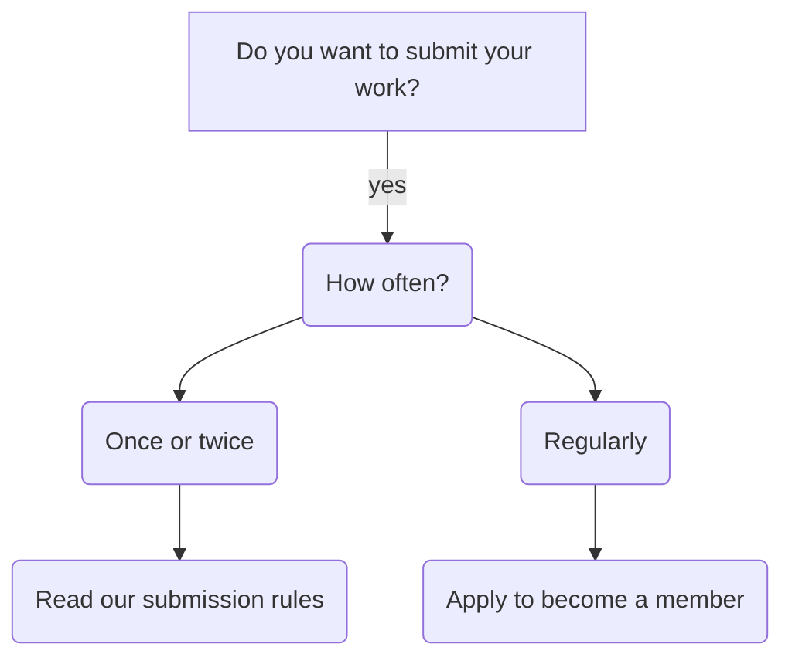

Anyone can join our organization without any fees or payments, you just need to register with us.

## What can organization members do that community members don't?

A community member is someone who engages with and shares our content, for example a Reddit subscriber or a social media follower. Community members can comment, share and remix our work freely with no barriers of entry.

Community members can also submit their own content and publish their content via our site or social media accounts. To submit your work as a community member you unfortunately need to jump through hoops, we have extensive and rigid instructions for community contributions to filter content not aligned with our values.

So if you intend to be a part of our community and publish your work you have to comply with the submission instructions even.

If instead you plan to contribute regularly it would be a hassle to go through the submission filter every time, if this is your case you can become a member to bypass this filtering process.

> You can click on _Read our submission rules_ and _Apply to become a member_ for more information.

## How to apply

The first step for becoming an official member is getting in contact via email, click the button below to send me an email, just fill in your explanation on why you want to join, what projects you have in mind, etc.

<a class="button button--secondary button--pill button--xl" href="mailto:digital-rights-info@protonmail.com?subject=Joining%20the%20organization&amp;body=Hello!%20I%20am%20interested%20in%20joining%20the%20org...%20%5BPlease%20add%20a%20brief%20explanation%5D">Send application!</a>

> If I don't respond in a week you can feel free to nag me about it on our [social media accounts][sm].

[sm]: https://digital-rights.github.io/contact

Once a member you can request to be added to our [GitTub organization page][gho] and make changes directly.

[gho]: https://github.com/digital-rights