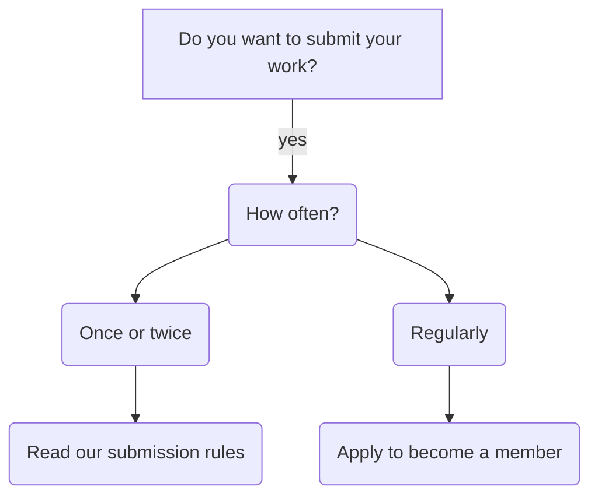

We welcome community contributions, if you want to publish an article, a video or other type of content you can learn how to do so here.

Our rules will soon change, in the close future we will also allow submitting your work via [our subreddit][srdr], for now follow the instructions below. 

[srdr]: https://www.reddit.com/r/digital_rights/

---

## Contact Information

### Email

> [digital-rights-info@protonmail.com](mailto:digital-rights-info@protonmail.com)

### Social media

[Facebook](https://digital-rights.github.io/facebook), [Twitter](https://digital-rights.github.io/twitter) & [YouTube](https://digital-rights.github.io/youtube).

---

# Table of contents:

* [Contact Information](#contact-information)
    * [Email](#email)
    * [Social media](#social-media)
* [How to contribute to our website](#how-to-contribute-to-our-website)
    * [Why not modify the main repository?](#why-not-modify-the-main-repository?)
    * [Report a bug / fix a bug](#report-a-bug--fix-a-bug)
    * [Correct content currently live on the website: Grammar, fact checking, add or update citations.](#correct-content-currently-live-on-the-website-grammar-fact-checking-add-or-update-citations)
    * [Publish Literature: Article or blog.](#publish-literature-article-or-blog)
    * [Publish Media: Video, info-graphic, podcast etc...](#publish-media-video-infographic-podcast-etc)
    * [How to make sure your contribution is compatible with the website's light version](#how-to-make-sure-your-contribution-is-compatible-with-the-website's-light-version)
    * [What license to choose](#what-license-to-choose)
        * [Brief explanation of both licenses](#brief-explanation-of-both-licenses)
            * [Creative Commons Attribution-ShareAlike](#creative-commons-attributionsharealike)
            * [GNU General Public License V3](#gnu-general-public-license-v3)
    * [Propose new iconography: Logo, icons or general branding of the site](#propose-new-iconography-logo-icons-or-general-branding-of-the-site)
    * [Propose a new post on social media / propose new social media presence](#propose-a-new-post-on-social-media--propose-new-social-media-presence)
    * [Edit our book](#edit-our-book)
    * [Change the look and feel of our site: Change theme, style-sheet, fix visual bugs.](#change-the-look-and-feel-of-our-site-change-theme-stylesheet-fix-visual-bugs)
* [Join our organization](#Join-our-organization)

---

## How to contribute to our website

To contribute to our site you must take a few thing in mind:

* All changes and contributions must be done on [_this repository_][dr-dev] and **never on the main repo**, to contibute you must fork this repository and make a pull request when you are ready to publish.
* Familiarize yourself with our work, read our blog or contact us for guidance.
* We use Markdown to format all of our written content, please familiarize with GitHub flavored Markdown, you can find a [tutorial here](https://commonmark.org/help/tutorial/). 
* Our website has a light version, all contributions must be compatible with both versions, learn more about how to adapt your content to the light version.
* keep your contributions nice and decluttered, host media files (like pictures and videos) outside of GitHub and link them in your contribution.
* Transparency and openness are our main values, all contributions must be published under applicable free culture licenses and the source files must be public as well.
* Be civil, remember the human and don't forget to communicate with us via e-mail if you have any questions.
* Follow the rules above **otherwise your contributions won't be added**.

[dr-dev]: https://github.com/alex-esc/dr-dev

> These rules will be referred to as _Base Rules_ from here onwards. feel free to skip to the section that best applies to your contribution or question.

---

### Why not modify the main repository?

Our website is hosted here on GitHub, to publish our site we have one main filter: _this repository_, this repo is a fork of our website, we use this reop to make several changes and when we're done we push the changes to the main repo all at once. Therefore the name of this repository is short for _Digital Rights developer_ (dr-dev).

---

### Report a bug / fix a bug

If you found a bug, please report it by opening an issue, remember to be very descriptive with your issue, try to describe how this bug could be replicated, take the base rules in mind.

To fix a bug follow the base rules and look up any other section on this document that applies.

---

### Correct content currently live on the website: Grammar, fact checking, add or update citations.

If your correction is quick and easy to fix, please consider helping us fix it by following the base rules and forking this repository and adding your correction and creating a pull request.

If you are not interested in fixing it yourself please open an issue on this repository, remember to be very descriptive with your issue and take the base rules in mind.

---

### Publish Literature: Article or blog.

* **Step 1 :** Follow our base rules, remember to fork this repository and make a pull request when you are done.

* **Step 2 :** Decide if your publication belongs inside the `documents` folder or the `_posts` folder:

|                 | Do you want our RSS subscribers to get notified about your work? |
|:----------------|:-----------------------------------------------------------------|
| use `documents` | No                                                               |
| use `_posts`    | Yes                                                              |

* **Step 3 :** Write your content using Markdown.

* **Step 4 :** Choose a free culture license. for more info go to our _what licensee to choose_ section.

* **Step 5 :** Credit yourself, read our theme's documentation on [how to credit your work](https://tianqi.name/jekyll-TeXt-theme/docs/en/authors).

* **Step 6 :** Make sure your contribution is compatible with the light version of the site, more info here.

* **Step 7 :** Publish your work by pushing your changes to this repository, after manual revision it will be pushed to the live site.

**Extra questions**

Make sure to read our theme's documentation,it will solve 90% of all questions, our theme is _the TeXt jekyll theme_ and you can find the documentation [here](https://tianqi.name/jekyll-TeXt-theme/docs/en/quick-start).

Any further questions can be solved by opening an issue on this repository or by sending us an e-mail.

---

### Publish Media: Video, info-graphic, podcast etc...

* **Step 1 :** Follow our base rules.

* **Step 2 :** Decide if your work belongs inside our website or our social media accounts:

| Where do you want your work to be present? | What to do                                   |
|:-------------------------------------------|:---------------------------------------------|
| Our website                                | Continue to next step                        |
| Our social media                           | Send us an e-mail and explain your situation |
| Both                                       | Continue to next step and send us an e-mail  |

* **Step 3 :** Create an article or blog to post your media, please read our section on how to _Publish Literature: Article or blog_. This post or blog must contain a link to the media, remember to never host your media files on GitHub since it's against the base rules. don't forget to credit yourself and to make your post compatible with the light version of our site.

* **Step 4 :** Upload your media into an appropriate site, for example use YouTube or Vimeo for hoting videos, SoundCloud or archive.org for audio, etc...

* **Step 6 :** Choose a free culture license and make it visible and clear on the site where it's uploaded. for more info on licenses read our section titled _What license to choose_.

* **Step 7 :**  Publish your work by pushing your changes to this repository, after manual revision it will be pushed to the live site.

**Recommendations**

The next list of recommendations is not necessary to get your work approved, but is greatly appreciated :)

* Use our branding inside your work.
* Create your work by using only Libre Software or as close as you can.
* Promote you content after it's publication to maximize it's reach and our message.
* Once you finish publishing your work keep tabs with us! We greatly appreciate contributors and we strive to build a community, maybe you can be involved inf future projects too!

---

### How to make sure your contribution is compatible with the website's light version

Our website also offerers a light version, the goal of this version is to reduce the digital footprint of the visitor by making the website as close to plain plain text as possible, this means the light version does not has any embedded content nor needs javascript to run or any scripts external to our website's domain.

The Light version of our website is located on the ['light' repository from our organization's GitHub account](https://github.com/digital-rights/light), it does not have any styling or any scripts, it only uses GitHub Page's Jekyll to format the content.

Therefore to make sure your contribution is compatible with the light version you must:

* **Step 1 :** Name your document with the _.md_ suffix, for example: `contribution.md`.
* **Step 2 :** Write the content using [GitHub flavored Markdown](https://github.github.com/gfm/) or by using plain HTML inside the Markdown document, for example:

		# Hello, this is a title

		Welcome to my contribution, I can use markdown to [format links](https://digital-rights.github.io/)

		or I can also use HTML <a href="https://digital-rights.github.io/">to accomplish the same task</a>. 

		Both are OK as long as the document has the _.md_ suffix.

* **Step 3 :** Remember to add the theme and style for the live version by adding a YAML Front Matter, you can find [documentation for our theme here](https://tianqi.name/jekyll-TeXt-theme/docs/en/writing-posts). Example:

		---
		layout: article
		title: Hello, this is a title
		---

		Welcome to my contribution, I can use markdown to [format links](https://digital-rights.github.io/)

* **Step 4 :** If there are elements that do not comply with GitHub flavored Markdown you must transform it into a link and add a HTML comment with your link, be descriptive with your link text, this link must comply with GitHub flavored Markdown. Please follow this instructions if any element in your content needs an external script to run, for example to add an embedded video you must change this:

		# Check out this cool video

		I found this video:

		<iframe width="560" height="315" src="https://www.youtube-nocookie.com/embed/HgzGwKwLmgM" frameborder="0" allow="accelerometer; autoplay; encrypted-media; gyroscope; picture-in-picture" allowfullscreen></iframe>

Into this:

		# Check out this cool video

		I found this video:

		<iframe width="560" height="315" src="https://www.youtube-nocookie.com/embed/HgzGwKwLmgM" frameborder="0" allow="accelerometer; autoplay; encrypted-media; gyroscope; picture-in-picture" allowfullscreen></iframe>
		
		<!--
		
		[Link to the video](https://www.youtube.com/watch?v=HgzGwKwLmgM)
		
		-->

This is a requirement, because when the light version is pushed live all embedded content will be removed and the link will be uncommented out, for example once the page is published to the light version it will look like this:

		# Check out this cool video

		I found this video:
		
		[Link to the video](https://www.youtube.com/watch?v=HgzGwKwLmgM)
		
* **Step 5 :** Remember the goal of the light version, we provide the light version to reduce the user's digital footprint, so adapt your contribution to do the same, this induces re-creating menus in markdown and re working external icons.

* **Step 6 :** Follow our base rules.

---

### What license to choose

Free culture is part of who we are as an organization, so we publish all of our work under free culture licenses.

| What type of content are you contributing?                  | Recommended license                                                                         |
|:------------------------------------------------------------|:--------------------------------------------------------------------------------------------|
| A creative work, like literature, visual art or other media | [Attribution-ShareAlike 4.0 International](https://creativecommons.org/licenses/by-sa/4.0/) |
| Software                                                    | [GNU General Public License V3](https://www.gnu.org/licenses/gpl.html)                      |

**What if I don't want a to choose a free culture license?**

Since we greatly value free culture, you must publish your work elsewhere, but you can still contribute your ideas and work by hosting your own website or blog, publishing your work there and then simply making a very short article or blog on our site just linking to your own domain.

If you choose to do so and you already wrote your post using Markdown and you need it on any other format, we recommend you use [pandoc](https://pandoc.org/) to convert your markdown folder into any other format.

For any other related questions please contact us via e-mail.

---

#### Brief explanation of both licenses

##### Creative Commons Attribution-ShareAlike

Creative Commons Attribution-ShareAlike license in International version 4, that allows to do what they want with your work as long as they share the work under the same license.

* Attribution:
You must give credit to the original author of the work, including a URI or hyperlink to the work, this Public license and a copyright notice.

* Attribution information revoke:
Author can request to remove any attribution given information.

* Tivoization:
You may not apply legal terms or technological measures that legally restrict others from doing anything the license permits.

* Disclaimer of warranties:
Disclaimer of warranties is optional.

	* If separately undertaken, shared material must retain a notice to Disclaimer of warranties.

	* Otherwise, Disclaimer of warranties, is taken by default, providing the work as-is and as-available.

* Liable:
Liable follows the same rules as Disclaimer of warranties, providing, by default, protection from defamation for the creator.

* Revoke:
The licensor cannot revoke these freedoms as long as you follow the license terms.

| **Can**        | **Cannot** | **Must**          |
|----------------|:----------:|------------------:|
| Commercial Use | Sublicense | Give Credit       |
| Distribute     |            | Include Copyright |
| Modify         |            | State Changes     |

> Explanation provided by tldr legal,  DISCLAIMER: THIS IS ONLY A SHORT SUMMARY OF THE FULL TEXT. NO INFORMATION ON TLDRLEGAL IS LEGAL ADVICE.

---

##### GNU General Public License V3

You may copy, distribute and modify the software as long as you track changes/dates in source files. Any modifications to or software including (via compiler) GPL-licensed code must also be made available under the GPL along with build & install instructions.

| **Can**           | **Cannot**  | **Must**                     |
|-------------------|:-----------:|-----------------------------:|
| Commercial Use    | Sublicense  | Include Original             |
| Distribute        | Hold Liable | State Changes                |
| Modify            |             | Disclose Source              |
| Place Warranty    |             | Include License              |
| Use Patent Claims |             | Include Copyright            |
|                   |             | Include Install Instructions |

> Explanation provided by tldr legal,  DISCLAIMER: THIS IS ONLY A SHORT SUMMARY OF THE FULL TEXT. NO INFORMATION ON TLDRLEGAL IS LEGAL ADVICE.

---

### Propose new iconography: Logo, icons or general branding of the site

All general design related contributions  and discussion (except for CSS changes) takes place in our [general design repository](https://github.com/digital-rights/general-design).

---

### Propose a new post on social media / propose new social media presence

Send us an e-mail and explain the post you want to contribute or new site you want us to join.

---

### Edit our book

Our book and our site are stored on different locations, to contribute to our book please go to the original repository, located [here](https://github.com/alex-esc/digitalrights).

---

### Change the look and feel of our site: Change theme, style-sheet, fix visual bugs.

**Push a new theme**

The design of this website follows the jekyll TeXt theme, this theme was chosen because jekyll is extremely simple, there fore if you want to change the look of this site you must take a few things in mind.

**What we look for in jekyll themes:**

* Modern good looking theme
* Licensed under a free culture license, MIT, public domain or other copyleft solution
* No Google fonts
* No privacy invading scripts
* Desktop and mobile compatible

If you find a better fitting jekyll theme or you created your own you can fork this repository and apply the new theme, if the theme is compatible with our requirements and it works without any major malfunction it is ready for revision, create a pull request and send us an email and we will implement the new theme if approved, the  you will be credited .

**fix visual bugs:**

Ether open an issue addressing the bug or fork this repo and push the bug fix and add yourself to the thank you page.

---

# Join our organization

## [digital-rights.github.io/join-us](https://digital-rights.github.io/join-us)

---

## Contact Information

### Email

> [digital-rights-info@protonmail.com](mailto:digital-rights-info@protonmail.com)

### Social media

[Facebook](https://digital-rights.github.io/facebook), [Twitter](https://digital-rights.github.io/twitter) & [YouTube](https://digital-rights.github.io/youtube).

---

